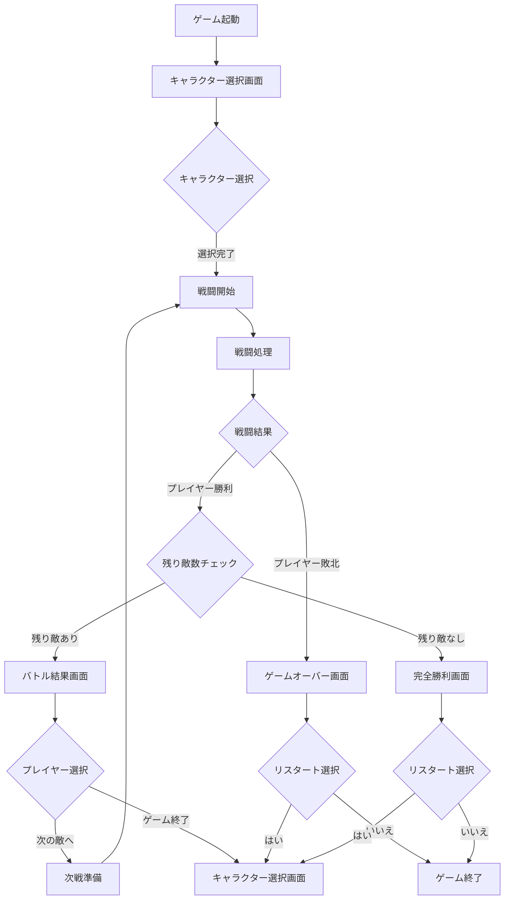
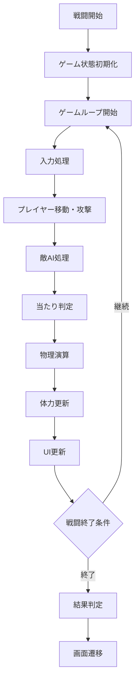
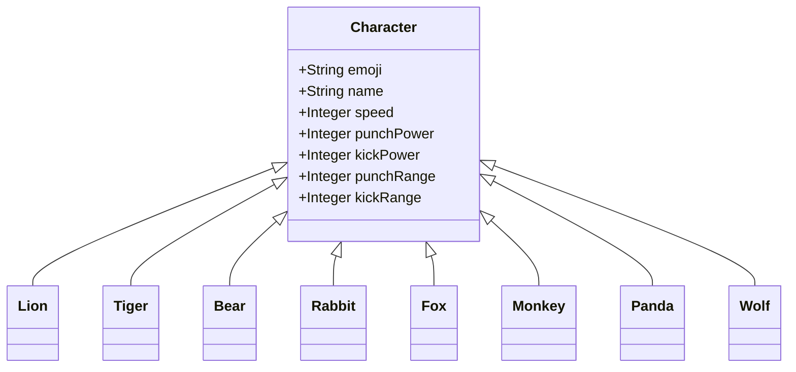
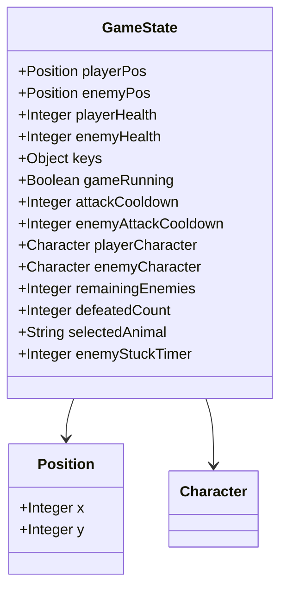
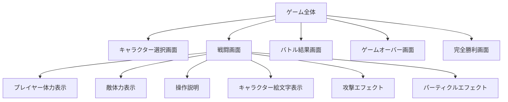
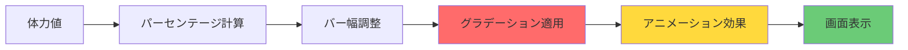
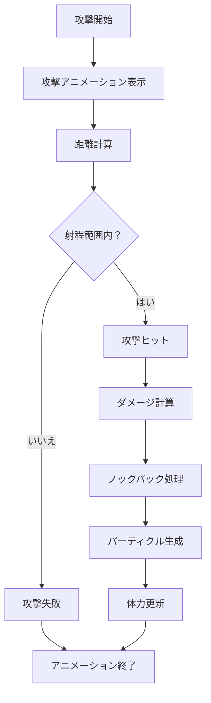
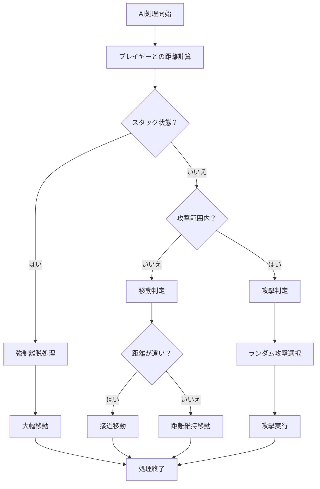
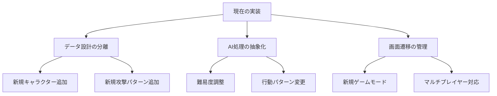

# 動物格闘ゲーム設計書

## はじめに

この設計書は、動物格闘ゲームの全体像と実装方針を示すものです。これは「建築設計図」のようなもので、ゲーム全体の構造を理解し、今後の機能拡張や改善を検討する際の道しるべとなります。

設計書の読み方として、まず各セクションの概要を理解してから、図表で詳細を確認する流れを推奨します。これにより、全体像から細部へと段階的に理解を深めることができます。

## 1. ゲーム概要

### 1.1 コンセプト

このゲームは「じゃんけんの拡張版」のような対戦ゲームです。プレイヤーは8種類の動物から1体を選び、残り7体の動物と順番に戦い、全てを倒すことで完全勝利を目指します。

各動物には個性的な能力値があり、「速いけど攻撃が弱い」「強いけど遅い」といったトレードオフ関係があります。これにより、プレイヤーは自分の戦略に合わせたキャラクター選択が重要になります。

### 1.2 基本的なゲームサイクル

ゲームの流れは「章立てされた小説」のような構造です：

1. **序章**：キャラクター選択（自分の「主人公」を決める）
2. **各章**：個別の戦闘（一つ一つの物語）
3. **結章**：完全勝利または敗北（物語の結末）

各戦闘は独立しており、勝利するたびに体力が全回復するため、プレイヤーは「新しい章が始まる」感覚で次の戦いに臨めます。

## 2. ゲームフローの設計

### 2.1 プレイヤーの体験設計

ゲーム全体の流れは「段階的な挑戦の旅」として設計されています。プレイヤーは小さな成功（個別の戦闘勝利）を積み重ねながら、最終的な大きな成功（完全勝利）を目指します。

下の図は、プレイヤーがたどる道のりを示しています。各分岐点は重要な意思決定ポイントであり、ゲーム体験の質を左右します。

**フロー図のポイント**：
- 各戦闘後に「仕切り直し」があることで、プレイヤーは達成感を味わえる
- 敗北してもリスタートできる設計により、挑戦への心理的ハードルを下げている
- 分岐点が明確で、プレイヤーが常に次の目標を理解できる

### 2.2 戦闘中の処理フロー

個別の戦闘は「リアルタイムの意思決定ゲーム」として設計されています。プレイヤーと敵AIが同時に行動し、その結果が即座に反映される仕組みです。

**戦闘フローの特徴**：
- 1秒間に約60回のループが回る高速処理
- 各フレームで全ての要素が更新される一貫性のある設計
- 終了条件が明確で、無限ループを防ぐ安全な構造

## 3. データ構造の設計

### 3.1 キャラクター設計の考え方

キャラクター設計は「職業選択RPG」の概念を参考にしています。各動物は特定の「職業」のような特性を持ち、プレイヤーは自分のプレイスタイルに合わせて選択できます。

下のクラス図は、全てのキャラクターが共通の基本構造を持ちながら、個別の数値で差別化される様子を示しています。

**設計の利点**：
- 新しいキャラクターの追加が容易
- 能力値の調整だけでバランス変更が可能
- 同じ処理ロジックを全キャラクターで共有できる

### 3.2 キャラクター能力値の設計思想

各キャラクターの能力値は「相互補完的」に設計されています。まるで「楽器のパート」のように、それぞれが異なる役割を持ちながら全体の調和を保っています。

| キャラクター | 速度 | パンチ威力 | キック威力 | パンチ範囲 | キック範囲 | 戦略的特徴 |
|------------|------|-----------|-----------|-----------|-----------|------------|
| ライオン🦁 | 3 | 1 | 1 | 35 | 35 | 初心者向けのバランス型 |
| トラ🐅 | 4 | 1 | 1 | 30 | 40 | 速攻とキック重視の戦術 |
| クマ🐻 | 2 | 2 | 1 | 40 | 30 | 一撃必殺のパワー型 |
| ウサギ🐰 | 5 | 1 | 1 | 25 | 35 | ヒット＆アウェイ戦術 |
| キツネ🦊 | 4 | 1 | 1 | 30 | 45 | 長距離攻撃の専門家 |
| サル🐵 | 4 | 1 | 1 | 35 | 30 | 機動性を活かした戦い |
| パンダ🐼 | 2 | 1 | 2 | 35 | 40 | 強力なキックが武器 |
| オオカミ🐺 | 3 | 1 | 1 | 32 | 38 | 中距離戦のスペシャリスト |

**能力値設計の原則**：
- 最強キャラクターが存在しない相対的バランス
- 各能力には長所と短所のセット
- プレイヤーの熟練度に合わせた選択肢の用意

### 3.3 ゲーム状態管理

ゲーム全体の状態は「オーケストラの指揮者」のような役割を持つ`GameState`オブジェクトで一元管理されています。これにより、複雑な状態間の連携を整合性を保ちながら実現できます。

**状態管理の利点**：
- 全ての重要情報が一箇所に集約
- 状態変更のタイミングを制御しやすい
- デバッグや拡張時の作業が効率的

## 4. ユーザーインターフェース設計

### 4.1 画面構成の考え方

UIデザインは「直感的な操作性」を最優先に設計されています。プレイヤーが迷うことなく、ゲームの世界に没入できるような配置と表現を心がけています。

**UI設計の基本原則**：
- 重要な情報は画面の上部に配置
- 操作説明は常に表示されている
- 視覚的フィードバックが豊富で、状況把握が容易

### 4.2 体力表示システムの仕組み

体力表示は「感覚的な理解」を重視した設計です。数値だけでなく、視覚的な変化で状況を即座に把握できるようにしています。

**体力バーの特徴**：
- 体力満タン時は鮮やかな色で表示
- ダメージを受けると徐々に色が変化
- スムーズなアニメーションで変化を演出
- 背景色で失われた体力量を表現

## 5. 処理ロジックの詳細

### 5.1 攻撃判定の流れ

攻撃判定は「的当てゲーム」のような仕組みで実装されています。攻撃者の「射程」と「タイミング」、防御者の「位置」の3要素が組み合わさって結果が決定されます。

**攻撃判定の工夫**：
- 攻撃範囲に少し余裕を持たせ、操作感を向上
- ノックバック効果で視覚的なフィードバックを提供
- パーティクルエフェクトで爽快感を演出

### 5.2 敵AI処理の設計思想

敵AIは「人間らしい思考プロセス」を模倣した設計です。状況に応じて行動を変化させ、単調にならない戦いを演出します。

**AI設計のポイント**：
- 最適な攻撃距離を保つ「間合い」の概念
- 引っ付きすぎた時の自動離脱機能
- ランダム性による行動の予測不可能さ

## 6. 将来の拡張可能性

### 6.1 拡張可能な設計思想

この設計は「レゴブロック」のような考え方で構成されています。各機能が独立したモジュールとして設計されているため、新しい機能を「積み重ねる」ように追加できます。

**機能拡張の方向性**：

1. **キャラクター要素の拡張**
   - 新しい動物の追加（海洋生物、鳥類など）
   - 各キャラクター固有の必殺技
   - 属性システム（火・水・風など）による相性

2. **戦闘システムの深化**
   - 3つ目の攻撃手段（必殺技など）
   - ガード・回避システムの追加
   - コンボシステムの実装

3. **ゲームモードの多様化**
   - 難易度設定（敵の強さ調整）
   - タイムアタックモード
   - サバイバルモード（無限戦）

4. **視覚・聴覚演出の充実**
   - キャラクターアニメーション
   - BGMとサウンドエフェクト
   - 特殊エフェクトの追加

### 6.2 技術的拡張の可能性

現在の実装は「将来への投資」として、拡張しやすい基盤を提供しています。

**拡張時の利点**：
- 既存コードへの影響を最小限に抑えられる
- 段階的な機能追加が可能
- 実験的機能の導入と取り外しが容易

## 7. 開発時の重要考慮事項

### 7.1 パフォーマンスへの配慮

ゲームは「リアルタイム処理」が生命線です。スムーズな動作を維持するための設計が随所に施されています。

**主な最適化ポイント**：
- パーティクルオブジェクトの自動削除
- DOMへの直接アクセスを最小化
- 重い計算処理の分散実行

### 7.2 ゲームバランスの調整

各キャラクターの能力値は「相対的な強さ」を重視して設計されています。完璧なバランスは存在しないため、継続的な調整が前提となっています。

**バランス調整の観点**：
- 初心者と上級者双方が楽しめる設計
- 特定キャラクターによる一方的な展開の回避
- プレイヤーの創意工夫の余地を残す

### 7.3 保守性とコード品質

「読みやすいコード」は「良いゲーム」の基盤です。将来の改修や機能追加を見据えた設計を心がけています。

**品質管理のアプローチ**：
- 機能ごとのモジュール化
- 共通処理の関数化
- 設定値の外部化による調整容易性

## 8. 設計の総括と今後の展望

この動物格闘ゲームの設計は、「シンプルさと拡張性のバランス」を追求したものです。現在の実装は最小限の機能に留めながらも、将来的な成長の余地を十分に確保しています。

**設計の核心的価値**：

1. **アクセシビリティ**: 誰でも簡単に始められる操作性
2. **戦略性**: 深く考えて楽しめる要素
3. **拡張性**: 成長し続けられる基盤

この設計書は「生きた文書」として、プロジェクトの成長とともに進化していきます。新しいアイデアが生まれたとき、問題が発見されたとき、機能を追加するとき、常にこの設計書を参照点として活用することで、プロジェクト全体の品質と一貫性を保つことができます。

**最後に**：ゲーム開発は「創造的な冒険」です。この設計書が、その冒険の良き道しるべとなることを願っています。技術的な正確さだけでなく、プレイヤーの笑顔を思い浮かべながら、楽しいゲーム作りを続けていきましょう。