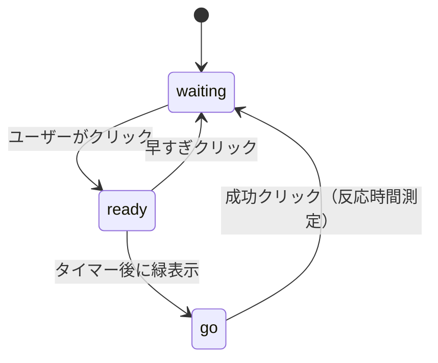
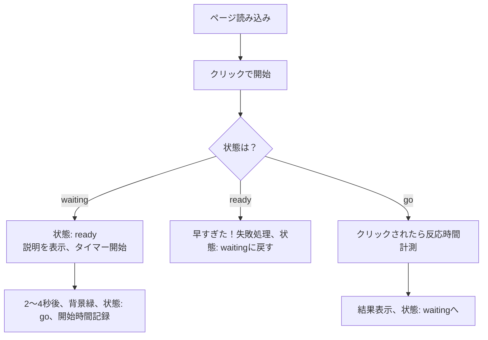

了解しました！  
以下に「反射神経テストゲーム」の設計書をMarkdown形式で作成します。  
ゲームの流れや状態遷移などは **Mermaid記法** を用いて視覚的に説明しています。

---

# 🎮 反射神経テストゲーム 設計書

---

## 📋 概要

**タイトル**：反射神経テスト  
**目的**：画面が緑になった瞬間を素早くクリックし、反応速度（ms）を測定する。  
**形式**：1ファイル（HTML+CSS+JS）構成でPC・スマホ両対応

---

## 🧩 機能一覧

|機能|説明|
|---|---|
|ゲーム開始|クリックでゲームを開始（状態：`waiting`→`ready`）|
|待機タイマー|ランダム2〜4秒後に画面が赤→緑に変化|
|成功クリック|緑になった後にクリック→反応時間を表示|
|フライング|緑になる前にクリック→失敗と表示|
|リトライ|任意の状態から再スタート可能|

---

## 🔄 状態遷移図（状態管理）

---

## 🎮 ゲームのフローチャート

---

## 💻 画面設計

### 📱 レイアウト構成

|エリア名|内容|
|---|---|
|`#game`|クリック領域（300x300pxのボックス）状態や指示、結果を表示|

### 🎨 色と状態の関係

|状態|背景色|テキスト|
|---|---|---|
|`waiting`|赤|「クリックで開始」など|
|`ready`|赤|「緑になったらクリック」|
|`go`|緑|「今だ！クリック！」|

---

## ⏱ タイミング制御

- 緑表示までの遅延：`Math.random() * 2000 + 2000`（＝2000ms〜4000ms）
    
- 反応時間：`new Date() - startTime` により計測
    

---

## 📦 使用技術

|要素|技術|
|---|---|
|構造|HTML|
|スタイル|CSS（Flexbox + Transition）|
|挙動|JavaScript（DOM + Timer + State管理）|

---

## 🔁 拡張案（今後の追加アイデア）

- ハイスコア記録（localStorage利用）
    
- スマホバイブ（`navigator.vibrate()`）
    
- 統計（平均/最速/回数）
    
- シンプルな音声フィードバック
    

---

ご希望あれば、この設計書をベースに**PDF化**や**Notion形式変換**、あるいは**拡張バージョンのコード**もご提供できます。  
このまま他のゲームの設計書も見てみますか？