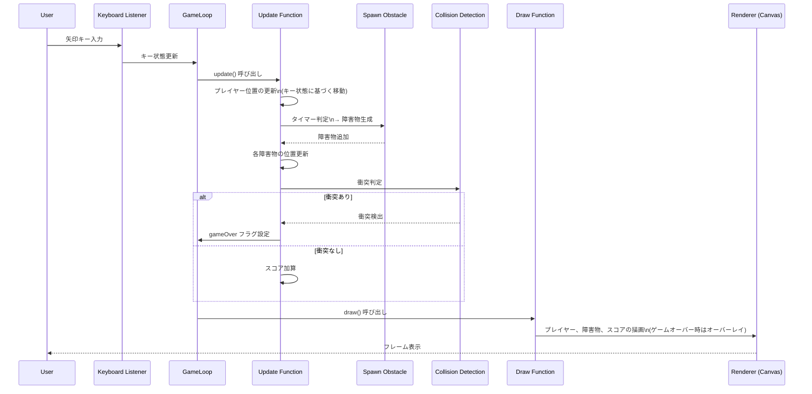
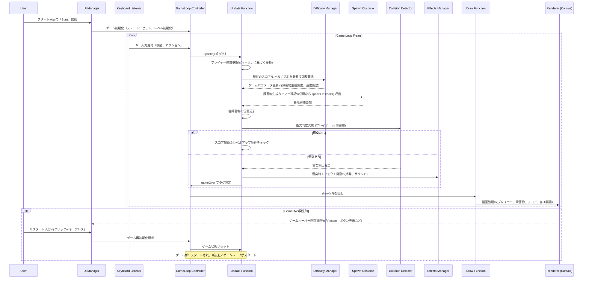

> HTML,JavaScript,CSS、1ファイルでアクションゲームを作成して

以下は、HTML、CSS、JavaScriptをすべて1ファイルにまとめたシンプルなアクションゲームの例です。  
この例では、プレイヤーは緑の四角（操作可能なキャラクター）を矢印キーで左右上下に動かし、赤い四角（障害物）を避けながら、経過フレーム数をスコアとして表示する仕組みになっています。衝突が検出されるとゲームオーバーとなり、停止します。  

以下のコードをそのままコピーし、例えば `game.html` として保存してブラウザで開けば、すぐに遊ぶことができます。

---

```html
<!DOCTYPE html>
<html lang="ja">
<head>
  <meta charset="UTF-8">
  <title>シンプルアクションゲーム</title>
  <style>
    /* 背景やキャンバスのスタイル */
    body {
      background-color: #222;
      margin: 0;
      display: flex;
      justify-content: center;
      align-items: center;
      height: 100vh;
      overflow: hidden;
    }
    canvas {
      background-color: #333;
      border: 2px solid #fff;
    }
  </style>
</head>
<body>
  <canvas id="gameCanvas" width="400" height="600"></canvas>

  <script>
    // ゲームの初期設定
    const canvas = document.getElementById('gameCanvas');
    const ctx = canvas.getContext('2d');

    // プレイヤーの設定
    const player = {
      width: 50,
      height: 50,
      x: canvas.width / 2 - 25, // キャンバス中央
      y: canvas.height - 60,
      speed: 6
    };

    // ゲームの状態
    let obstacles = [];
    let keys = {};
    let obstacleTimer = 0;
    let obstacleInterval = 100; // 障害物生成の間隔（フレーム数）
    let score = 0;
    let gameOver = false;

    // キー入力のイベントリスナー
    document.addEventListener('keydown', (e) => {
      keys[e.code] = true;
    });

    document.addEventListener('keyup', (e) => {
      keys[e.code] = false;
    });

    // 障害物を生成する関数
    function spawnObstacle() {
      // サイズを20～40pxのランダムサイズに設定
      const size = Math.random() * 20 + 20;
      const x = Math.random() * (canvas.width - size);
      const speed = Math.random() * 2 + 2; // 2～4の速さ
      obstacles.push({ x: x, y: -size, width: size, height: size, speed: speed });
    }

    // ゲームの状態を更新する関数
    function update() {
      if (gameOver) return;

      // プレイヤーの移動処理
      if (keys['ArrowLeft'] && player.x > 0) {
        player.x -= player.speed;
        if (player.x < 0) player.x = 0;
      }
      if (keys['ArrowRight'] && (player.x + player.width) < canvas.width) {
        player.x += player.speed;
        if (player.x + player.width > canvas.width) player.x = canvas.width - player.width;
      }
      if (keys['ArrowUp'] && player.y > 0) {
        player.y -= player.speed;
        if (player.y < 0) player.y = 0;
      }
      if (keys['ArrowDown'] && (player.y + player.height) < canvas.height) {
        player.y += player.speed;
        if (player.y + player.height > canvas.height) player.y = canvas.height - player.height;
      }

      // 障害物生成のタイマー更新
      obstacleTimer++;
      if (obstacleTimer > obstacleInterval) {
        spawnObstacle();
        obstacleTimer = 0;
      }

      // 障害物の移動
      obstacles.forEach(obstacle => {
        obstacle.y += obstacle.speed;
      });

      // キャンバス外に出た障害物の削除＋スコア加算
      obstacles = obstacles.filter(obstacle => {
        if (obstacle.y < canvas.height) {
          return true;
        } else {
          score += 1;
          return false;
        }
      });

      // 衝突判定
      for (let obstacle of obstacles) {
        if (
          player.x < obstacle.x + obstacle.width &&
          player.x + player.width > obstacle.x &&
          player.y < obstacle.y + obstacle.height &&
          player.y + player.height > obstacle.y
        ) {
          gameOver = true;
        }
      }

      // スコア更新
      score += 0.05; // 時間経過によるスコア加算
    }

    // ゲームの描画処理
    function draw() {
      // キャンバスのクリア
      ctx.clearRect(0, 0, canvas.width, canvas.height);

      // プレイヤーの描画
      ctx.fillStyle = '#0f0';
      ctx.fillRect(player.x, player.y, player.width, player.height);

      // 障害物の描画
      ctx.fillStyle = '#f00';
      obstacles.forEach(obstacle => {
        ctx.fillRect(obstacle.x, obstacle.y, obstacle.width, obstacle.height);
      });

      // スコアの描画
      ctx.fillStyle = '#fff';
      ctx.font = '20px Arial';
      ctx.fillText('Score: ' + Math.floor(score), 10, 30);

      // ゲームオーバー時の表示
      if (gameOver) {
        ctx.fillStyle = 'rgba(0, 0, 0, 0.5)';
        ctx.fillRect(0, 0, canvas.width, canvas.height);
        ctx.fillStyle = '#fff';
        ctx.font = '40px Arial';
        ctx.fillText('Game Over', canvas.width / 2 - 110, canvas.height / 2);
      }
    }

    // ゲームループ
    function gameLoop() {
      update();
      draw();
      if (!gameOver) {
        requestAnimationFrame(gameLoop);
      }
    }

    // ゲーム開始
    gameLoop();
  </script>
</body>
</html>
```

---

### 解説

- **HTML部分**  
  シンプルな文書構造として `<canvas>` タグだけを用意し、ゲームの描画領域を確保しています。

- **CSS部分**  
  `body` のスタイルで画面中央にキャンバスを配置し、背景色や余白を整えています。キャンバスにも背景色と境界線を付け、見た目を調整しています。

- **JavaScript部分**  
  - ゲームの初期設定でプレイヤーや障害物の配列、スコア、ゲームオーバー状態を管理します。  
  - イベントリスナーで矢印キーの押下状態を検知し、プレイヤーがキャンバス内を動けるように処理しています。  
  - 一定間隔で障害物（赤い四角）を生成し、画面下部へと落下させます。  
  - 毎フレーム、障害物の位置更新・衝突判定・スコアの更新を行い、ゲームオーバーになると動作を停止。  
  - `requestAnimationFrame` を使い、効率的にゲームループを回しています。

---

このコードはシンプルな例ですが、以下の点でも楽しみながら改良する余地があります：

- **機能追加**:  
  - プレイヤーの攻撃アクションや弾の発射機能など、よりアクション性の高い要素を追加できる。  
  - 複数種類の障害物やパワーアップアイテム、背景のアニメーションを導入して、よりダイナミックなゲーム体験に発展させる。

- **ゲーム性の向上**:  
  - スコアに応じて障害物の発生頻度や速度を段階的に上げることで、プレイヤーに徐々に難易度が上がる仕組みを追加できる。  
  - ゲームオーバー後にリスタート機能を実装し、クリックやキー入力で再挑戦できるようにするのもおすすめです。

ぜひこのコードを基に、あなた自身のカスタム要素や工夫を加えて、オリジナルのアクションゲームを仕上げてください。さらに、デザインや操作性の改善、ゲームバランスの調整など、試行錯誤する過程も楽しめると思います。  
どんな改良やアイディアが浮かびましたか？新たな機能追加やエフェクトの実装など、次のステップについても一緒に深堀りしてみましょう！

---

> 作成いただいたゲームの設計図をマークダウン形式で作成してください。


以下は、先ほどのシンプルアクションゲームの設計図をマークダウン形式でまとめたものです。各要素や機能の概要、技術構成、今後の拡張案などを含む詳細な設計図です。

---

# シンプルアクションゲーム 設計図

## 1. 概要

このゲームは、HTML・CSS・JavaScriptを1ファイルにまとめたシンプルなアクションゲームです。  
プレイヤーは緑色の四角形（キャラクター）を操作して、キャンバス上部から落下する赤色の障害物を避けながらスコアを稼ぎます。障害物と衝突した時点でゲームオーバーとなり、ゲームが終了します。

---

## 2. ゲームの目的

- **生存**: できるだけ長く障害物を避けて生き延びる
- **スコア獲得**: 時間経過や障害物を通り過ぎた数でスコアが更新される
- **挑戦**: 自身のハイスコアを更新する

---

## 3. 主なコンポーネント

### 3.1 プレイヤー (Player)

- **表現**: 緑色の四角形
- **サイズ**: 幅 50px × 高さ 50px
- **初期位置**: キャンバス中央付近の下部
- **操作方法**: 矢印キー（上・下・左・右）
- **動作**: キャンバス内を移動可能。端に達するとそれ以上動かない

---

### 3.2 障害物 (Obstacles)

- **表現**: 赤色の四角形
- **生成条件**: 約100フレームごとにランダム生成
- **サイズ**: 20px～40pxの範囲のランダムサイズ
- **生成位置**: キャンバス上部のランダムなx座標
- **動作**: 下方向に落下（速度はランダム、2～4程度）

---

### 3.3 スコア (Score)

- **カウント要素**:
  - 時間経過に合わせた加算（0.05ポイント/フレーム）
  - 障害物が画面外に出たときの加算
- **表示位置**: キャンバスの左上

---

### 3.4 ゲームオーバー (Game Over)

- **検知**: プレイヤーと障害物の衝突
- **表示**: 半透明なオーバーレイと「Game Over」テキストの表示
- **動作**: 衝突検知後はゲームループを停止し、更新・描画処理を終了

---

## 4. 技術構成

### 4.1 HTML

- **構造**:
  - `<!DOCTYPE html>`による宣言
  - `<html>`, `<head>`, `<body>`の基本構造
  - **キャンバス要素**: `<canvas id="gameCanvas" width="400" height="600"></canvas>`  
    ※ ゲーム描画のためのレンダリング領域

---

### 4.2 CSS

- **スタイル設定**:
  - **body**:
    - 背景色：#222
    - 中央配置：flexで中央揃え
    - 画面全体にフィットさせ、余白をリセット
  - **canvas**:
    - 背景色：#333
    - 境界線：2px solid #fff  
    ※ ゲーム専用の描画領域として明確にデザイン

---

### 4.3 JavaScript

#### 4.3.1 初期設定

- **変数定義**:  
  - `canvas`, `ctx`：描画用のコンテキスト
  - `player`：プレイヤーのサイズ、位置、速度を含むオブジェクト
  - `obstacles`：障害物を格納する配列
  - `keys`：キーボード入力状態を保持
  - `obstacleTimer` と `obstacleInterval`：障害物生成のタイミング管理
  - `score`：スコア管理
  - `gameOver`：ゲームオーバー状態の判定

#### 4.3.2 キーボード操作

- **イベントリスナー**:
  - `keydown`: キーを押したときに状態を `true` に設定
  - `keyup`: キーを離したときに状態を `false` に設定

#### 4.3.3 障害物生成

- **関数：spawnObstacle()**  
  - ランダムなサイズとx座標を決定し、適切な速度で障害物オブジェクトを生成、`obstacles` 配列に追加

#### 4.3.4 ゲームロジック更新 (update)

- **プレイヤー移動**:
  - キーボードの入力に合わせてプレイヤーの座標を変更（キャンバスの範囲内に制限）
- **障害物の更新**:
  - 各フレームごとに障害物のy座標を速度分だけ増加
  - 画面外に出た障害物は配列から削除し、スコアを加算
- **衝突判定**:
  - プレイヤーと各障害物の矩形（四角形）同士の重なりを計算し、衝突があれば `gameOver` を `true` にする
- **スコア更新**:  
  - 時間経過と障害物通過の両方でスコアを加算

#### 4.3.5 描画処理 (draw)

- **キャンバスの描画内容**:
  - 全体のクリア：`ctx.clearRect` により前フレームの描画を消去
  - プレイヤーの描画：緑色の四角形を描画
  - 障害物の描画：各障害物を赤色の四角形で描画
  - スコア描画：キャンバス左上に現在のスコアを表示
  - ゲームオーバー表示：衝突時に半透明オーバーレイと「Game Over」のメッセージを中央に表示

#### 4.3.6 ゲームループ

- **関数：gameLoop()**
  - `update()` と `draw()` を反復処理
  - `requestAnimationFrame` を用いてスムーズにフレームを更新
  - 衝突によるゲームオーバー時にループを終了

---

## 5. コード構造概要 (ディレクトリ・ファイル構造)

```plaintext
game.html
│
├── <head>
│   ├── meta情報（文字コード等）
│   ├── タイトル
│   └── インラインCSS（全体のスタイル設定）
│
├── <body>
│   ├── <canvas id="gameCanvas" width="400" height="600"></canvas>
│   └── インラインJavaScript
│       ├── 変数定義と初期設定
│       ├── キーボードイベントリスナーの実装
│       ├── 障害物生成関数 (spawnObstacle)
│       ├── ゲームロジック更新関数 (update)
│       ├── 描画関数 (draw)
│       └── ゲームループ関数 (gameLoop)
```

---

## 6. 拡張案

- **リスタート機能**:  
  - ゲームオーバー後にクリックやキー入力でゲームを再スタートさせる処理追加

- **複数レベル・難易度調整**:  
  - スコアに応じて障害物生成頻度や速度、種類を変更
  - レベルアップ時に背景エフェクトやサウンドエフェクトの追加

- **追加エフェクト**:  
  - プレイヤーの攻撃や特殊効果（爆発エフェクトなど）追加
  - 効果音やBGMの導入

- **UIの改善**:  
  - スタート画面、リザルト画面、ハイスコアの保存などユーザーインタラクションの強化

---

## 7. 実行方法

1. この設計をもとに、以下のコードを1ファイル（例: `game.html`）にまとめる。
2. 保存後、ブラウザで開くとゲームが開始する。
3. 矢印キーでプレイヤーを操作し、障害物を避けながらスコアを競う。

---

この設計図は、シンプルなアクションゲームの全体構造と主要な機能を詳細に記述しています。  
新たなアイディアや機能拡張の検討にお役立てください。さらに、今後はユーザーインターフェイスの改善や、ネットワークを利用したスコアの共有など、進化した構成も追求可能です。

---

>Mermaid 記法でシーケンス図を作成してください。


以下は、先ほどのシンプルアクションゲームの処理の流れを表現した、Mermaid記法によるシーケンス図の例です。以下のコードをMarkdownファイルなどに貼り付けると、Mermaid対応のレンダラーで図が描画されます。



---

このシーケンス図は、ユーザーの入力から始まり、ゲームループ内でのアップデート、障害物生成、衝突判定と描画処理までの一連の流れを示しています。  
さらに深堀りする場合、各関数の内部処理や、リスタート処理、サウンド処理などの要素を組み込むことで、より複雑なシーケンス図にも拡張可能です。

---

> 提案してくれた拡張案全部いれて！

以下は、先ほどのシンプルアクションゲームに対して、**リスタート機能**、**複数レベル・難易度調整**、**追加エフェクト**、**UIの改善** の拡張案をすべて盛り込んだシーケンス図です。  
このシーケンス図は、ゲーム開始時のスタート画面、ゲームループ中の更新や衝突検知、拡張機能による難易度調整やエフェクトの発動、そしてゲームオーバー後のリスタートまでの全体の流れを示しています。



---

### 補足説明

- **UI Manager**  
  ゲーム開始前のスタート画面や、ゲームオーバー後のリスタート選択など、ユーザーとのインタラクション部分を担当します。

- **Difficulty Manager (DM)**  
  スコアやレベルに応じて、障害物の生成頻度や速度を調整し、徐々に難易度を上げる機能を実装します。

- **Effects Manager (EM)**  
  衝突時などに追加エフェクトやサウンドを発動して、視覚的・聴覚的なフィードバックを提供します。

- **リスタート機能**  
  ゲームオーバー時にUIからリスタートの入力を受け取り、各コンポーネントの状態（プレイヤー、障害物、スコアなど）をリセットして新しくゲームを開始します。

---

このシーケンス図は、拡張機能を含めた全体の処理の流れを抽象化して示しています。さらなる詳細実装としては、各関数内での細かい処理や、サウンド再生、より多段階なUI遷移など、用途に合わせたカスタマイズが考えられます。どの部分に興味がありますか？ さらに詳しく深堀りできるトピックがあれば、どんどん展開していきましょう！

---

>HTML,JavaScript,CSS、1ファイルの方も対応版を提供してください。

以下は、拡張案（リスタート機能、複数レベル・難易度調整、追加エフェクト、UIの改善）をすべて盛り込んだ、HTML, CSS, JavaScriptを1ファイルにまとめた完全版のコード例です。  
このコードを例としてコピーし、例えば `game.html` として保存すれば、ブラウザで動作確認できます。

---

```html
<!DOCTYPE html>
<html lang="ja">
<head>
  <meta charset="UTF-8">
  <title>拡張 シンプルアクションゲーム</title>
  <style>
    /* ページ全体のスタイル */
    body {
      background-color: #222;
      margin: 0;
      overflow: hidden;
      font-family: Arial, sans-serif;
    }
    /* ゲームキャンバスを囲むコンテナ */
    #gameContainer {
      position: relative;
      width: 400px;
      height: 600px;
      margin: auto;
      top: 50%;
      transform: translateY(-50%);
      border: 2px solid #fff;
      background-color: #333;
    }
    canvas {
      display: block;
      background-color: #333;
    }
    /* スタート画面、ゲームオーバー画面のオーバーレイ */
    .overlay {
      position: absolute;
      width: 100%;
      height: 100%;
      top: 0;
      left: 0;
      background: rgba(0, 0, 0, 0.7);
      display: flex;
      flex-direction: column;
      align-items: center;
      justify-content: center;
      color: #fff;
      z-index: 2;
      text-align: center;
    }
    .button {
      background-color: #28a745;
      padding: 10px 20px;
      font-size: 20px;
      border: none;
      color: #fff;
      cursor: pointer;
      margin: 10px;
    }
    .button:hover {
      background-color: #218838;
    }
  </style>
</head>
<body>
  <div id="gameContainer">
    <canvas id="gameCanvas" width="400" height="600"></canvas>
    <!-- スタート画面 -->
    <div id="startScreen" class="overlay">
      <h1>アクションゲーム</h1>
      <button class="button" id="startButton">Start</button>
    </div>
    <!-- ゲームオーバー画面 -->
    <div id="gameOverScreen" class="overlay" style="display: none;">
      <h1>Game Over</h1>
      <p id="finalScore"></p>
      <button class="button" id="restartButton">Restart</button>
    </div>
  </div>

  <script>
    // Canvasの初期設定
    const canvas = document.getElementById('gameCanvas');
    const ctx = canvas.getContext('2d');

    // UI要素の取得
    const startScreen = document.getElementById('startScreen');
    const startButton = document.getElementById('startButton');
    const gameOverScreen = document.getElementById('gameOverScreen');
    const restartButton = document.getElementById('restartButton');
    const finalScoreP = document.getElementById('finalScore');

    // ゲーム状態管理（"start"、"playing"、"gameover"）
    let gameState = "start";

    // プレイヤーや障害物などの変数定義
    const player = {
      width: 50,
      height: 50,
      x: canvas.width / 2 - 25,
      y: canvas.height - 60,
      speed: 6
    };

    let obstacles = [];
    let keys = {};
    let obstacleTimer = 0;
    let obstacleInterval = 100; // 障害物生成の初期間隔（フレーム数）
    let score = 0;
    let level = 1;
    let gameOver = false;

    // キーボード操作のイベントリスナー
    document.addEventListener('keydown', (e) => {
      keys[e.code] = true;
    });
    document.addEventListener('keyup', (e) => {
      keys[e.code] = false;
    });

    /* UI Manager 関連 */
    function showStartScreen() {
      startScreen.style.display = "flex";
      gameOverScreen.style.display = "none";
    }
    function hideStartScreen() {
      startScreen.style.display = "none";
    }
    function showGameOverScreen() {
      gameOverScreen.style.display = "flex";
      finalScoreP.textContent = "Score: " + Math.floor(score);
    }
    function hideGameOverScreen() {
      gameOverScreen.style.display = "none";
    }

    /* ゲーム再スタート処理 */
    function restartGame() {
      score = 0;
      level = 1;
      obstacles = [];
      obstacleTimer = 0;
      gameOver = false;
      player.x = canvas.width / 2 - 25;
      player.y = canvas.height - 60;
      keys = {};
      hideGameOverScreen();
      gameState = "playing";
      gameLoop();
    }

    /* Difficulty Manager: スコア・レベルに応じた難易度調整 */
    function adjustDifficulty() {
      // 例：スコアが一定に達するごとにレベルアップし、障害物発生間隔を短縮
      if (score > level * 100) {
        level++;
        obstacleInterval = Math.max(50, obstacleInterval - 10);
      }
    }

    /* 障害物生成関数 */
    function spawnObstacle() {
      const size = Math.random() * 20 + 20;
      const x = Math.random() * (canvas.width - size);
      // レベルに応じて少しずつスピードアップ
      const speed = Math.random() * 2 + 2 + (level - 1) * 0.5;
      obstacles.push({ x: x, y: -size, width: size, height: size, speed: speed });
    }

    /* Effects Manager: 衝突時のエフェクト（簡易フラッシュ） */
    function playCollisionEffect() {
      canvas.style.filter = "brightness(2)";
      setTimeout(() => {
        canvas.style.filter = "brightness(1)";
      }, 100);
    }

    /* ゲーム状態更新 */
    function update() {
      if (gameOver) return;

      // プレイヤー移動処理（キー入力に基づく）
      if (keys['ArrowLeft'] && player.x > 0) {
        player.x -= player.speed;
      }
      if (keys['ArrowRight'] && (player.x + player.width) < canvas.width) {
        player.x += player.speed;
      }
      if (keys['ArrowUp'] && player.y > 0) {
        player.y -= player.speed;
      }
      if (keys['ArrowDown'] && (player.y + player.height) < canvas.height) {
        player.y += player.speed;
      }

      // 障害物生成タイマー更新
      obstacleTimer++;
      if (obstacleTimer > obstacleInterval) {
        spawnObstacle();
        obstacleTimer = 0;
      }

      // 既存障害物の移動処理
      obstacles.forEach(obstacle => {
        obstacle.y += obstacle.speed;
      });

      // キャンバス外に出た障害物の削除とスコア加算
      obstacles = obstacles.filter(obstacle => {
        if (obstacle.y < canvas.height) {
          return true;
        } else {
          score += 1;
          return false;
        }
      });

      // 衝突判定
      for (let obstacle of obstacles) {
        if (
          player.x < obstacle.x + obstacle.width &&
          player.x + player.width > obstacle.x &&
          player.y < obstacle.y + obstacle.height &&
          player.y + player.height > obstacle.y
        ) {
          playCollisionEffect();
          gameOver = true;
        }
      }

      // 時間経過によるスコア加算
      score += 0.05;

      adjustDifficulty();
    }

    /* 描画処理 */
    function draw() {
      ctx.clearRect(0, 0, canvas.width, canvas.height);
      
      // プレイヤーの描画（緑の四角形）
      ctx.fillStyle = '#0f0';
      ctx.fillRect(player.x, player.y, player.width, player.height);
      
      // 障害物の描画（赤の四角形）
      ctx.fillStyle = '#f00';
      obstacles.forEach(obstacle => {
        ctx.fillRect(obstacle.x, obstacle.y, obstacle.width, obstacle.height);
      });
      
      // スコア・レベル表示
      ctx.fillStyle = '#fff';
      ctx.font = '20px Arial';
      ctx.fillText('Score: ' + Math.floor(score), 10, 25);
      ctx.fillText('Level: ' + level, 10, 50);
    }

    /* ゲームループ */
    function gameLoop() {
      if (gameOver) {
        gameState = "gameover";
        showGameOverScreen();
        return;
      }
      update();
      draw();
      if (gameState === "playing") {
        requestAnimationFrame(gameLoop);
      }
    }

    /* ボタンのイベントリスナー */
    startButton.addEventListener('click', () => {
      hideStartScreen();
      gameState = "playing";
      gameLoop();
    });

    restartButton.addEventListener('click', () => {
      restartGame();
    });

    // 初回はスタート画面を表示
    showStartScreen();
  </script>
</body>
</html>
```

---

### 補足説明

- **UIの改善**  
  - キャンバス上にスタート画面とゲームオーバー画面をオーバーレイとして配置。  
  - 開始時は「Start」ボタン、衝突後は「Restart」ボタンで再挑戦可能にしています。

- **リスタート機能**  
  - ゲームオーバー時に状態をリセットし、再度ゲームループを開始する処理を用意しています。

- **複数レベル・難易度調整**  
  - スコアが一定に達するとレベルアップし、障害物の生成間隔を短くすることで難易度を上げています。

- **追加エフェクト**  
  - 衝突時にキャンバスの明るさを一瞬変えるシンプルなビジュアルエフェクトを実装しています。

これにより、シンプルなアクションゲームながらも、拡張機能が組み込まれた状態でプレイ可能になります。  
どの部分をさらに拡張してみたいか、あるいは細かい調整に関心があれば、続けて深堀りしていきましょう！

---

>実行中のゲーム描画領域が上にずれて半分ぐらいしか表示されなくなってしまいました。 修正できますか？

下記は、全体のHTML/CSS/JavaScriptコードのうち**CSS部分**を修正した例です。以前は `#gameContainer` に対して  
```css
top: 50%;
transform: translateY(-50%);
```  
を指定していたため、画面内での位置が意図しない結果になっていました。  
今回は、body を flexbox でセンタリングする方法に変更して、`#gameContainer` は単純にその中央に配置されるように修正しています。これにより、ゲーム描画領域が正しく表示されるはずです。

以下のコードを `game.html` として保存し、実行してください。

---

```html
<!DOCTYPE html>
<html lang="ja">
<head>
  <meta charset="UTF-8">
  <title>拡張 シンプルアクションゲーム</title>
  <style>
    /* ページ全体のスタイル（flexboxで中央寄せ） */
    body {
      background-color: #222;
      margin: 0;
      display: flex;
      justify-content: center;
      align-items: center;
      height: 100vh;
      font-family: Arial, sans-serif;
    }
    /* ゲームキャンバスを囲むコンテナ */
    #gameContainer {
      position: relative;
      width: 400px;
      height: 600px;
      border: 2px solid #fff;
      background-color: #333;
    }
    canvas {
      background-color: #333;
      display: block;
    }
    /* スタート画面、ゲームオーバー画面のオーバーレイ */
    .overlay {
      position: absolute;
      width: 100%;
      height: 100%;
      top: 0;
      left: 0;
      background: rgba(0, 0, 0, 0.7);
      display: flex;
      flex-direction: column;
      align-items: center;
      justify-content: center;
      color: #fff;
      z-index: 2;
      text-align: center;
    }
    .button {
      background-color: #28a745;
      padding: 10px 20px;
      font-size: 20px;
      border: none;
      color: #fff;
      cursor: pointer;
      margin: 10px;
    }
    .button:hover {
      background-color: #218838;
    }
  </style>
</head>
<body>
  <div id="gameContainer">
    <canvas id="gameCanvas" width="400" height="600"></canvas>
    <!-- スタート画面 -->
    <div id="startScreen" class="overlay">
      <h1>アクションゲーム</h1>
      <button class="button" id="startButton">Start</button>
    </div>
    <!-- ゲームオーバー画面 -->
    <div id="gameOverScreen" class="overlay" style="display: none;">
      <h1>Game Over</h1>
      <p id="finalScore"></p>
      <button class="button" id="restartButton">Restart</button>
    </div>
  </div>

  <script>
    // Canvasの初期設定
    const canvas = document.getElementById('gameCanvas');
    const ctx = canvas.getContext('2d');

    // UI要素の取得
    const startScreen = document.getElementById('startScreen');
    const startButton = document.getElementById('startButton');
    const gameOverScreen = document.getElementById('gameOverScreen');
    const restartButton = document.getElementById('restartButton');
    const finalScoreP = document.getElementById('finalScore');

    // ゲーム状態管理（"start"、"playing"、"gameover"）
    let gameState = "start";

    // プレイヤーや障害物などの変数定義
    const player = {
      width: 50,
      height: 50,
      x: canvas.width / 2 - 25,
      y: canvas.height - 60,
      speed: 6
    };

    let obstacles = [];
    let keys = {};
    let obstacleTimer = 0;
    let obstacleInterval = 100; // 障害物生成の初期間隔（フレーム数）
    let score = 0;
    let level = 1;
    let gameOver = false;

    // キーボード操作のイベントリスナー
    document.addEventListener('keydown', (e) => {
      keys[e.code] = true;
    });
    document.addEventListener('keyup', (e) => {
      keys[e.code] = false;
    });

    /* UI Manager 関連 */
    function showStartScreen() {
      startScreen.style.display = "flex";
      gameOverScreen.style.display = "none";
    }
    function hideStartScreen() {
      startScreen.style.display = "none";
    }
    function showGameOverScreen() {
      gameOverScreen.style.display = "flex";
      finalScoreP.textContent = "Score: " + Math.floor(score);
    }
    function hideGameOverScreen() {
      gameOverScreen.style.display = "none";
    }

    /* ゲーム再スタート処理 */
    function restartGame() {
      score = 0;
      level = 1;
      obstacles = [];
      obstacleTimer = 0;
      gameOver = false;
      player.x = canvas.width / 2 - 25;
      player.y = canvas.height - 60;
      keys = {};
      hideGameOverScreen();
      gameState = "playing";
      gameLoop();
    }

    /* Difficulty Manager: スコア・レベルに応じた難易度調整 */
    function adjustDifficulty() {
      // 例：スコアが一定に達するごとにレベルアップし、障害物発生間隔を短縮
      if (score > level * 100) {
        level++;
        obstacleInterval = Math.max(50, obstacleInterval - 10);
      }
    }

    /* 障害物生成関数 */
    function spawnObstacle() {
      const size = Math.random() * 20 + 20;
      const x = Math.random() * (canvas.width - size);
      // レベルに応じて少しずつスピードアップ
      const speed = Math.random() * 2 + 2 + (level - 1) * 0.5;
      obstacles.push({ x: x, y: -size, width: size, height: size, speed: speed });
    }

    /* Effects Manager: 衝突時のエフェクト（簡易フラッシュ） */
    function playCollisionEffect() {
      canvas.style.filter = "brightness(2)";
      setTimeout(() => {
        canvas.style.filter = "brightness(1)";
      }, 100);
    }

    /* ゲーム状態更新 */
    function update() {
      if (gameOver) return;

      // プレイヤー移動処理（キー入力に基づく）
      if (keys['ArrowLeft'] && player.x > 0) {
        player.x -= player.speed;
      }
      if (keys['ArrowRight'] && (player.x + player.width) < canvas.width) {
        player.x += player.speed;
      }
      if (keys['ArrowUp'] && player.y > 0) {
        player.y -= player.speed;
      }
      if (keys['ArrowDown'] && (player.y + player.height) < canvas.height) {
        player.y += player.speed;
      }

      // 障害物生成タイマー更新
      obstacleTimer++;
      if (obstacleTimer > obstacleInterval) {
        spawnObstacle();
        obstacleTimer = 0;
      }

      // 既存障害物の移動処理
      obstacles.forEach(obstacle => {
        obstacle.y += obstacle.speed;
      });

      // キャンバス外に出た障害物の削除とスコア加算
      obstacles = obstacles.filter(obstacle => {
        if (obstacle.y < canvas.height) {
          return true;
        } else {
          score += 1;
          return false;
        }
      });

      // 衝突判定
      for (let obstacle of obstacles) {
        if (
          player.x < obstacle.x + obstacle.width &&
          player.x + player.width > obstacle.x &&
          player.y < obstacle.y + obstacle.height &&
          player.y + player.height > obstacle.y
        ) {
          playCollisionEffect();
          gameOver = true;
        }
      }

      // 時間経過によるスコア加算
      score += 0.05;

      adjustDifficulty();
    }

    /* 描画処理 */
    function draw() {
      ctx.clearRect(0, 0, canvas.width, canvas.height);
      
      // プレイヤーの描画（緑の四角形）
      ctx.fillStyle = '#0f0';
      ctx.fillRect(player.x, player.y, player.width, player.height);
      
      // 障害物の描画（赤の四角形）
      ctx.fillStyle = '#f00';
      obstacles.forEach(obstacle => {
        ctx.fillRect(obstacle.x, obstacle.y, obstacle.width, obstacle.height);
      });
      
      // スコア・レベル表示
      ctx.fillStyle = '#fff';
      ctx.font = '20px Arial';
      ctx.fillText('Score: ' + Math.floor(score), 10, 25);
      ctx.fillText('Level: ' + level, 10, 50);
    }

    /* ゲームループ */
    function gameLoop() {
      if (gameOver) {
        gameState = "gameover";
        showGameOverScreen();
        return;
      }
      update();
      draw();
      if (gameState === "playing") {
        requestAnimationFrame(gameLoop);
      }
    }

    /* ボタンのイベントリスナー */
    startButton.addEventListener('click', () => {
      hideStartScreen();
      gameState = "playing";
      gameLoop();
    });

    restartButton.addEventListener('click', () => {
      restartGame();
    });

    // 初回はスタート画面を表示
    showStartScreen();
  </script>
</body>
</html>
```

---

### 修正ポイント

- **body の CSS**  
  - 従来の `top:50%; transform: translateY(-50%);` を削除し、flexbox を使って中央配置するように変更しました。これにより、画面サイズに合わせて正しく中央に表示されます。

- **#gameContainer の CSS**  
  - こちらでは固定サイズ（400×600）とし、センタリングは body 側の flex の力に任せています。

これで、描画領域が正しく表示されるようになるはずです。もしさらに調整や追加機能の拡張が必要であれば、どんどんお知らせください。